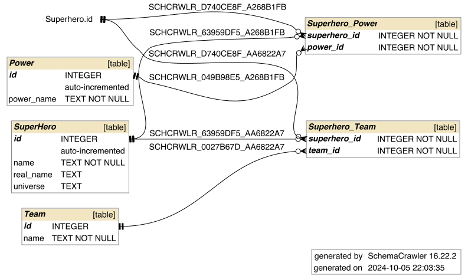

# AIQueryGenerator

## Description
The database is about superheroes, it has data and relationships between superheroes, powers, and superhero teams.

## Database Schema


## Example

### Question
"Give me the all superheroes that only have 1 power."

### Query
```
SELECT SuperHero.name
FROM SuperHero
JOIN Superhero_Power ON SuperHero.id = Superhero_Power.superhero_id
GROUP BY SuperHero.id
HAVING COUNT(Superhero_Power.power_id) = 1;
```

### Response
"The query result is: Iron Man."


# Other Examples
See EXAMPLES.md file

# Prompting Strategies Used

Zero-shot Text-to-SQL was the main prompting strategy I used. My database was simple enough where Chat-GTP had no issues with generating queries. 

